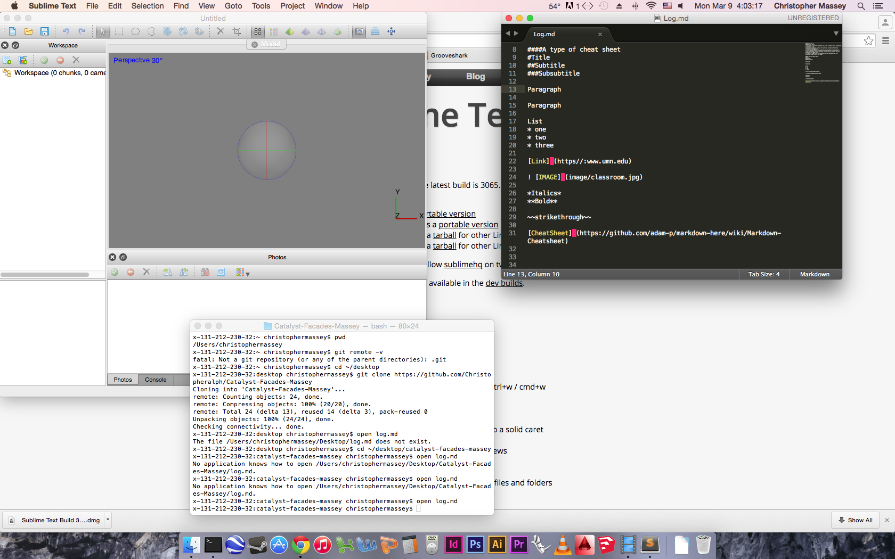

##Catalyst Day 1
#####Initial Ideas
* Thresholds- analyzing typologies of a city, whether scale, materiality, reflectivity, etc.
* Perceptual contours- analyze for patterns, glitches/intentially/confusing photograhmetry
* Crowd sourcing photos for a building, how facebook or instagram or flickr understand certain buildings. Similarily how academic journals understand the same ones.
* Creating a eiggn face for buildings and then applying that to a conceptual model like an ice cube.

####A type of cheat sheet
#Title
##Subtitle
###Subsubtitle

Paragraph

Paragraph

List
* one
* two
* three

[Link](https//:www.umn.edu)

*Italics*
**Bold**

~~strikethrough~~

[CheatSheet] (https://github.com/adam-p/markdown-here/wiki/Markdown-Cheatsheet)

